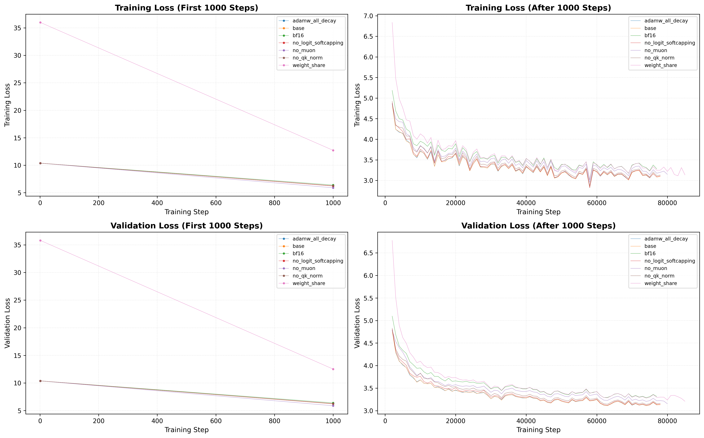
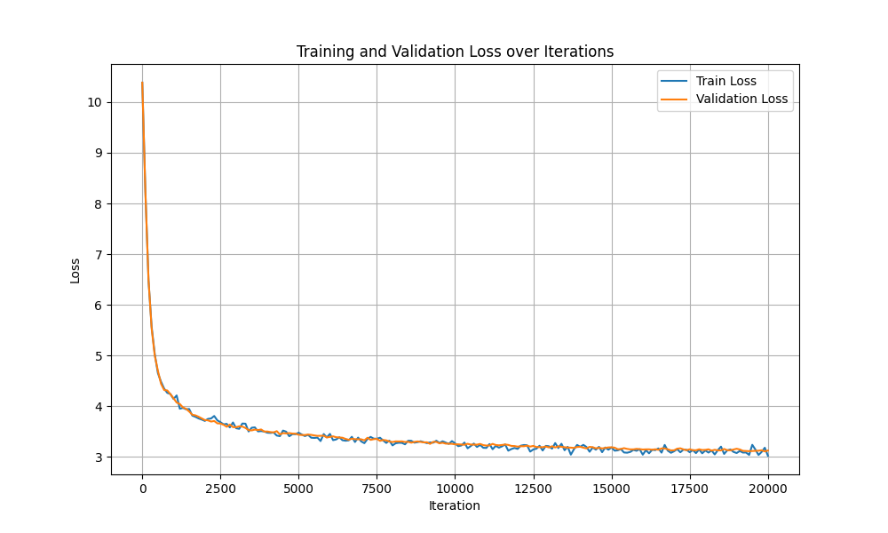

# CS336的课后作业
## A1 构建 Transformer LM 模型
- `assignment1-basics/cs336_basics/bpe/bpe_trainer.py`: 并行分词器训练脚本；
- `assignment1-basics/cs336_basics/bpe/streaming_bpe_trainer.py`: 流式分词器训练脚本；
- `assignment1-basics/cs336_basics/bpe/profile_bpe_trainer.py`: cProfile脚本；
- `assignment1-basics/text_compression_ratio.py`: 压缩率测试脚本；
- `assignment1-basics/text2int.py`: 字符数据集转id数据集的脚本；
- `assignment1-basics/train.py`: LM训练脚本（单卡）；
- `assignment1-basics/train_distributed.py`: LM分布式训练脚本（多卡DDP）；
- `assignment1-basics/run_distributed.sh`: 分布式训练启动脚本；
- `assignment1-basics/plot_loss.py`: 绘图脚本；
- `assignment1-basics/inference.py`: 推理对话脚本；
- `assignment1-basics/LR_range_test.py`: 学习率查找脚本；
- `assignment1-basics/val.py`: 验证脚本；
- `assignment1-basics/cs336_basics/bpe/rust_accel.py`: Rust加速模块；

### BPE编码器
- [x] 实现bpe编码器的训练逻辑；
- [x] 实现并行的预分词过程（无法通过测试代码可以尝试改小并行进程数）；
- [x] 实现分词器类使用分词结果；
- [x] 词表保存磁盘格式兼容huggingface格式；
- [x] 解决openweb大规模数据集在有限内存训练的问题（流式预分词）；
- [x] 修复流式预分词的并行化问题
- [x] 修复多线程cProfile的pickle问题
- [x] 实现merge过程的Rust/PyO3 加速实现

### Transformer语言模型架构
- [x] 实现线性层和嵌入层；
- [x] 实现RMSNorm；
- [x] 实现SiLU和SwiGLU的FFN层；
- [x] 实现RoPE编码；
- [x] 实现softmax函数；
- [x] 实现缩放点积注意力；
- [x] 实现多头自注意力；
- [x] 实现大矩阵乘法计算多头自注意力；
- [x] 实现transformer块；
- [x] 搭建完整的transformer语言模型；
- [x] 实现模型的参数量估计函数和计算量估计函数；
- [ ] 修正存在错误的显存和FLOPs计算函数；
- [x] 增加梯度累计；

### 训练Transformer语言模型
- [x] 实现交叉熵函数；
- [x] 实现AdamW优化器；
- [x] 实现带预热的余弦学习率调度；
- [x] 实现梯度剪裁；

### 训练循环
- [x] 实现数据加载器；
- [x] 实现checkpointing的保存和加载；
- [x] 实现完整的训练脚本；

### 分布式训练 (DDP，大多数内容由vibe-coding实现) 
- [x] 实现基于 PyTorch DDP 的多卡数据并行训练；
- [x] 支持 torchrun 和 mp.spawn 两种启动方式；
- [x] 实现分布式检查点的保存和加载（rank 0 保存，广播同步）；
- [x] 实现跨进程的路径信息同步（固定长度 tensor 广播）；
- [x] 按 GPU 数量自动缩放迭代次数，保持总样本量不变；
- [x] 配置 NCCL 环境变量，支持单机多卡通信；

### 生成文本
- [x] 搭建 generate text 过程；
- [x] 增加采样规则，实现top-p, temperature等功能
- [ ] 增加top-k采样规则

### 实验
- [x] 实现日志检查和损失曲线绘制功能；
- [x] 实现推理功能；
- [x] 增加学习率查找脚本；

### 扩展功能
- [x] DDP多卡训练；
- [x] 开启pytorch compile，并使用矩阵乘法加速；
- [x] 实现Muon优化器和AdamW优化器混合（3.75 → 3.73）；
- [x] 增加QK-Norm正则化项（3.73 → 3.69）；
- [x] 增加logit softcapping功能；
- [x] 扩大了模型参数（45.2M → 134M，3.10）；
- [x] 增加了early stopping功能；
- [x] 增加了可选的Embedding层和输出层的权重共享机制；

### 消融实验结果
以下是各优化技巧对验证集损失(val loss)的影响：

| 优化技巧 | 测试集损失(val loss) | 变化 |
|---|---|---|
| Baseline | 3.1692 | - |
| + Norm AdamW decay | 3.1751 | -0.0059 |
| - Logit Softcapping | 3.1833 | -0.0141 |
| - QK-Norm正则化 | 3.2052 | -0.036 |
| - Muon优化器混合 | 3.2109 | -0.0417 |
| + 权重共享 | 3.2836 | -0.1144 |
| + BF16 | 3.3523 | -0.1831 |

## A2 底层算子优化
- `assignment2-systems/cs336_systems/benchmarking_script.py`: 基准测试脚本；
- `assignment2-systems/cs336_systems/pytorch_attention.py`: 测试原生注意力机制的脚本；
- `assignment2-systems/cs336_systems/flash_attention_pytorch.py`: FlashAttention的PyTorch实现（其中的反向传播逻辑被Triton脚本服用）；
- `assignment2-systems/cs336_systems/flash_attention.py`: FlashAttention的Triton实现；
- `assignment2-systems/cs336_systems/flash_benchmarking.py`: FlashAttention的基准测试脚本；
- `assignment2-systems/cs336_systems/ddp.py`: DDP实现（包含扁平化和重叠版本）；
- `assignment2-systems/cs336_systems/naive_ddp.py`: 基础版DDP实现；
- `assignment2-systems/cs336_systems/distributed_demo.py`: 分布式训练演示脚本；
- `assignment2-systems/cs336_systems/distributed_communication_single_node.py`: 单节点分布式通信测试脚本；
- `assignment2-systems/cs336_systems/triton_demo.py`: Triton内核演示脚本；
- `assignment2-systems/cs336_systems/run_ddp.sh`: DDP训练启动脚本；

### 性能分析与基准测试
- [x] 编写端到端前向/反向传播基准测试脚本；
- [ ] 使用 Nsight Systems 分析核函数耗时和计算占比；
- [x] 使用 `torch.cuda.memory._record_memory_history` 分析模型峰值显存占用情况；

### 注意力机制优化与 FlashAttention-2
- [x] 使用 PyTorch 按照分块逻辑实现 FlashAttention-2 的前向传播；
- [x] 使用 Triton 编写 FlashAttention-2 的前向传播 Kernel；
- [x] 实现 FlashAttention 的因果掩码功能；
- [x] 使用 PyTorch 实现 FlashAttention-2 反向传播（重计算策略），并通过 `torch.compile` 编译优化；
- [ ] 用 Triton 实现反向传播内核；

### 分布式数据并行训练 (DDP)
- [x] 实现基础版 (Naïve) DDP 类
- [x] 实现扁平化DDP；
- [x] 实现重叠版 (Overlap) DDP；
- [x] 实现分桶 (Bucketed) DDP；

### 优化器状态分片 (ZeRO-1)
...

### 实验一融合实验二
- 融合flash-attention：显存占用大幅降低（43.7GB → 26.9GB），速度提升（预期8.2h → 7h）；
- 融合DDP优化：
    - 扁平化DDP(大幅加速9h20m → 8h50m)
    - 分桶DDP(速度几乎无变化，设置小分桶如1MB还会拖累速度，模型参数较小)

耗时3:37:50，验证集结果为3.1239（相比实验一调整了保存模型的逻辑，删除了early stop）

# A5 后训练和对齐
- `assignment5-alignment/cs336_alignment/drgrpo_grader.py`: DRGRPO评分器；
- `assignment5-alignment/cs336_alignment/vllm_demo.py`: vllm 使用示例；
- `assignment5-alignment/cs336_alignment/pre_threat.py`: 预处理数据并提取label脚本；
- `assignment5-alignment/cs336_alignment/inference.py`: vll 推理脚本；
- `assignment5-alignment/cs336_alignment/evaluate.py`: 评估脚本；
- `assignment5-alignment/cs336_alignment/util.py`: 工具脚本，包含SFT所需的若干helper函数；
- `assignment5-alignment/cs336_alignment/train_sft.py`: SFT训练脚本；
- `assignment5-alignment/cs336_alignment/run_vllm_eval`: 训练过程中调用vllm进行评估的脚本；
- `assignment5-alignment/cs336_alignment/rl_util.py`: GRPO新增的工具脚本；
- `assignment5-alignment/cs336_alignment/train_grpo.py`: GRPO训练脚本；

## 评估
- [x] 完成了使用vllm推理脚本；
- [x] 完成了评估脚本；
## SFT
- [x] 实现了tokenize prompt并应用掩码；
- [x] 实现计算预测熵的功能；
- [x] 实现计算response log prob的功能；
- [x] 实现masked normalize的功能；
- [x] 实现了sft_microbatch_train_step的功能；
- [x] 实现了双卡SFT + vllm推理；
## GRPO
- [x] 实现了计算组内标准差的函数（有偏估计）；
- [x] 实现了朴素策略梯度；
- [x] 实现clip loss;
- [x] 实现策略梯度包装起；
- [x] 实现mask mean；
- [x] 实现GRPO微批次梯度更新；
- [x] 实现了GRPO训练脚本；

## 在GSM8K上的实验结果
| 模型 | format_reward | answer_reward |
|---|---|---|
| base模型| 0.5512 | 0.1304 |
| SFT模型 | 0.8211 | 0.3412 |
| GRPO模型 | 0.9109 | 0.7089 |
| 使用base模型做GRPO | 0.9030 | 0.6543 |
| no-baseline | 0.9538 | 0.6937 |
| Dr GRPO | 0.9507 | 0.7384 |
| biased | 0.9507 | 0.6839 |
| ppo_step=2(等效step) | 0.8070 | 0.7020 |
| ppo_step=2 | 0.9409 | 0.7506 |
| ppo_step=2(无clip) | 0.9621 | 0.6168 |
| ppo_step=3(等效step) | 0.9393 | 0.7195 |
| ppo_step=3| 0.9092 | 0.7339 |
| ppo_step=3(无clip)| 0.9469 | 0.6028 |
| Dr GRPO + ppo_step=2 | 0.9795 | 0.7733 |